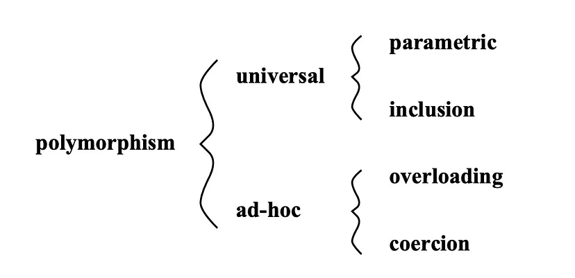
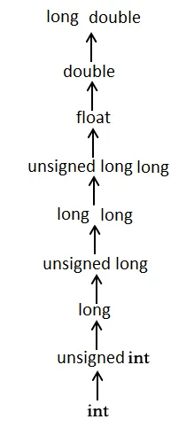

# Полиморфизм

Все, что может содержать значения различных типов или обрабатывать их, является **полиморфным**.

Определение полиморфиза из книги Б. Пирса "Типы в языках программирования": 

*Термин “полиморфизм” обозначает семейство различных механизмов, позволяющих использовать один и тот же участок программы с различными типами в различных контекстах*. (грубо говоря, контекст - набор переменных)

## Разновидности полиморфизма

* __Универсальный__ (universal)
	* _параметрический_ (parametric)
	* _полиморфизм включений_ (inclusion)
* __Специальный__ (ad-hoc)
	* _перегрузка_ (overloading)
	* _приведение типов_ (coercion)

**Универсально полиморфные** функции работают на неограниченном кол-ве типов. Функция будет выполнятся для аргумента *любого типа*. Он позволяет описывать вычисления в *общем случае*.

**Специально полиморфные** функции работают с конечным набором *конкретных типов*. Для каждого типа аргуметов реализуется *свой способ вычислений*, т. е. в нем происходит *диспетчеризация (перенаправление)* к одной или нескольким функциям для конкретного типа аргумента.

### Параметрический полиморфизм

Универсальный вид полиморфизма. Он позволяет описывать вычисления *в общем виде*, функции, к-ые могут работать с *любыми типами* данных. Такие функции называются **параметрически полиморфными**.

Для создания параметрически полиморфных функций можно использовать *переменные для типов (\<T\>)*. Вместо \<T\> будет подставлен уже конкретный тип данных.

Пример сигнатуры функции тождества на псевдокоде. Она должна работать с любыми типами:

	indentity: <T> (x: T) -> T

Параметрически полиморфные функции также называют *обобщенными (Generic)*.

Пример функции тождества на TypeScript, реализованной с помощью *дженериков*:

	function indentity <T> (arg: T): T {
		return arg;
	}

Реализация indentity на языке Elm:

	indentity : a -> a -- Это сигнатура
	indentity a = a

В сигнатуре функции *a* - это переменная типа. Если опустить явное описание сигнатуры, то компилятор вычислит ее сам. Это называется *выводом типов*.

Пример сигнатуры функции фильтрации (сортировки), в к-ой используется переменная типа, на языке Elm:

	(a -> Bool) -> List a -> List a

в динамически типизированных языках применение параметрического полиморфизма не имеет смысла, так как у переменных нет статически объявляемых типов.

### Перегрузка

Специальный вид полиморфизма. Он позволяет объявлять функции с *одним и тем же именем*, но с *разными типами* аргументов и их *кол-ом (арностью)*.

Во время вызова компилятор сам определит версию перегруженной функции (диспетчеризация) на основе типов ее аргументов. При необходимости диспетчеризация может быть *ручной*.

### Подтипирование

Два подхода, на основе чего может быть реализована система подтипизации:

* Реализация на *включениях (inclusive)*. Любое значение типа А - это в то же время значение типа В, если А - подтип В. В ОО языках подтипирование основано на включениях. 

* Реализация на *приведении (coercive)*. Занчение типа А может быть сконвертировано в значение типа В.

### Полиморфизм включений

Универсальный вид полиморфизма. В нем функции или операторы могут содержать один или множество аргументов, типы к-ых имеют подтипы. Т. е. с помощью этого полиморфизма *можно описать вычисления не только для конкретного типа, но и для всех его подтипов*.

В ООП полиморфизм включений отражает *принцип подстановки Барбары Лисков (SOLID)*: 

*Функции, к-ые используют базовый тип, должны иметь возможность использовать подтипы базового типа, не зная об этом*

Функции, к-ые могут работать не только с базовым типом (классом), но и с его подтипами (наследниками), являются также полиморфными.

Полиморфизм включений обеспечивается не только возможностью функции работать со всеми подтипами, но и *переопределением методов в наследуемых классах*.

*Утиная типизация* не является полиморфизмом. Она присуща динамически типизированным языкам. С ее точки зрения, если два объекта имеют *одинаковое поведение*, то они относятся к **одному типу**. Например:

	const obj1 = { 
	  myMethod: () => console.log('hello'),
	  propA: 'value' 
	}
	
	const obj2 = {
	  myMethod: () => console.log('hellohello')
	  propB: 'value'
	}
	
	const callMethod = obj => obj.myMethod()
	
	callMethod(obj1)
	callMethod(obj2)

С точки зрения утиной типизации obj1 и obj2 - это объекты одного типа. Отсюда следует, что функция callMethod не является полиморфной, т. к. она не обрабатывает значения *разных* типов.

## Приведение типов

Приведение типов может быть *явным (casting)* и *неявным (coercion)*. Неявное приведение типов - это специальный вид полиморфизма.

### Почему неявное приведение типов - вид полиморфизма?

Пример на псевдокоде:

	fn sum(a: Float, b: Float) -> Float:
	  return a + b 
	
	sum(1, 2)       // 3.0
	sum(1.0, 2)     // 3.0
	sum(1, 2.0)     // 3.0
	sum(1.0, 2.0)   // 3.0

Функция sum является полиморфной, т.к. она *неявного приводит тип свих аргументов*.

Из примера выше следует, что неявное приведение типов будет являться полиморфизмом, т. к. функция sum *переиспользуется в рамках конкретных типов (один и тот же участок кода переиспользуется с разным контекстом)*, что по определению из книги Б. Пирса есть полиморфизм.

### Расширение и сужение типов

Неявно приводимые типы могут находиться в *отношении подтипизации*. Например, в C++ отношение подтипизации для численных типов выглядит следующим образом:

Неявное приведение типов может происходить как в сторону *расширения типов* — движение вверх по иерархии на схеме выше, так и в сторону *сужения типов* — движение вниз по иерархии на схеме выше.

**Замечание:** неявное приведение может работать *не только* для типов, к-ые находятся в *отношении подтипизации*.